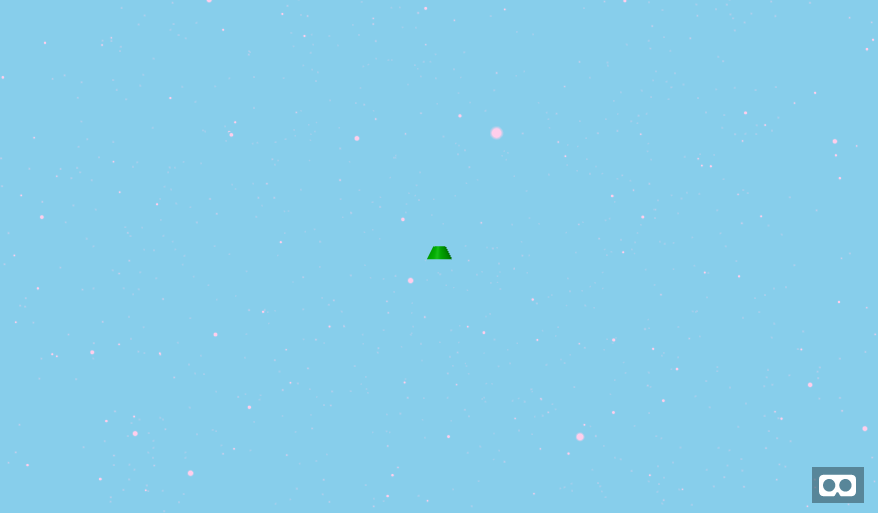

aframe-dust-component
===

An [A-Frame](https://aframe.io) [WebVR](https://webvr.info/) component that surrounds the user
with a cloud of particles.
As the user moves, particles from behind the user respawn in front
(so you don't have to fill the whole space with particles).

This provides visual feedback on the user's motion, which is useful when flying or
moving in unearthly spaces.

Can also be used to add atmosphere - pink fairy lights for a paradise,
black ash for a hellscape.

The performance cost is modest, unless you use tens of thousands of particles.



[live example scene](https://dougreeder.github.io/aframe-dust-component/example.html) - use WASD + mouse to look around

Used in [Elfland Glider](https://elfland-glider.surge.sh/)

Basic Usage
---
```html
<script src="https://unpkg.com/aframe-dust-component@^1.0.5/aframe-dust-component.js"></script>

<a-dust></a-dust>
```
Leave the position at 0 0 0, and place the dust as a direct child of the scene.

You should explicitly set a camera (or a "vehicle" that contains the camera)
in some `init` function:
```javascript
let cameraEl = sceneEl.querySelector('[camera]');
let dustEl = sceneEl.querySelector('a-dust');

// delays setup until there's some slack time (for Safari or Edge, you'll need to polyfill requestIdleCallback)
requestIdleCallback( () => {
	dustEl.components.dust.setCamera(cameraEl);
});

```


Advanced Usage
---
```html
<script src="https://unpkg.com/aframe-dust-component@^1.0.5/aframe-dust-component.js"></script>

<a-dust num-points="24576" dispersion="200" color="black" point-size="4"></a-dust>
```

```javascript
let cameraEl = sceneEl.querySelector('[camera]');
let dustEl = sceneEl.querySelector('a-dust');

// delays setup until there's some slack time (for Safari or Edge, you'll need to polyfill requestIdleCallback)
requestIdleCallback( () => {
	dustEl.components.dust.setCamera(cameraEl);
});

```

Properties
---

### color
CSS color of particles; default **gray**

### num-points
The number of particles; default **128**

### dispersion
How close the particles will stay to the user, in meters; default **100**

### point-size
The size of particles, in pixels; default **1**
